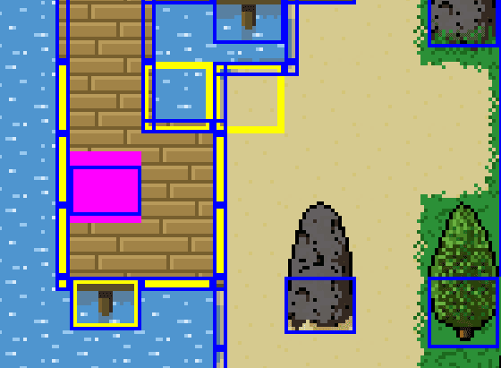
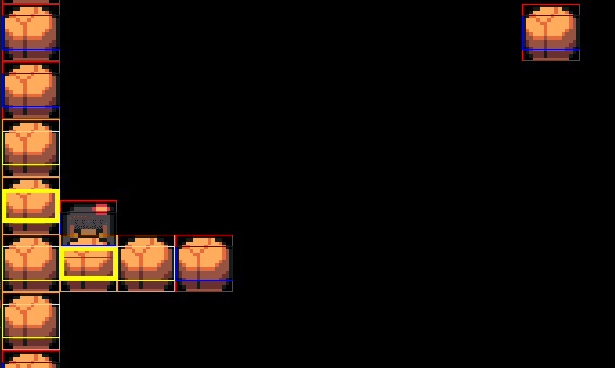
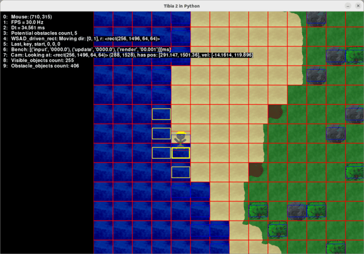
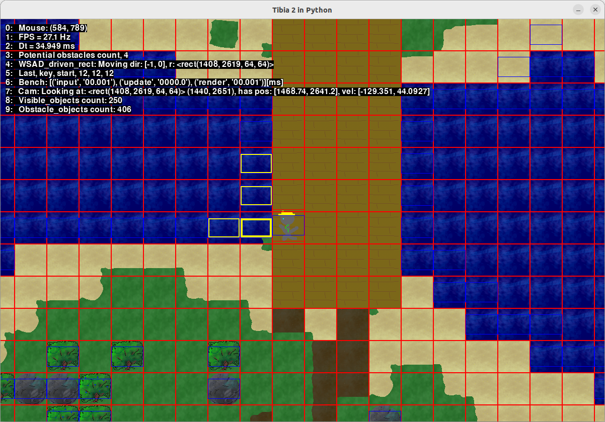
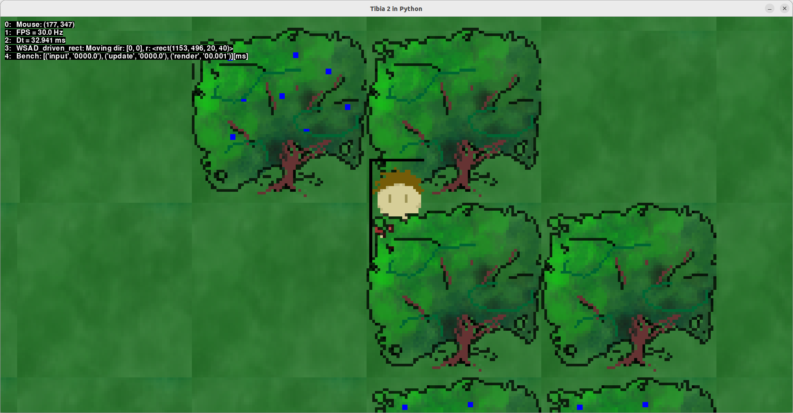
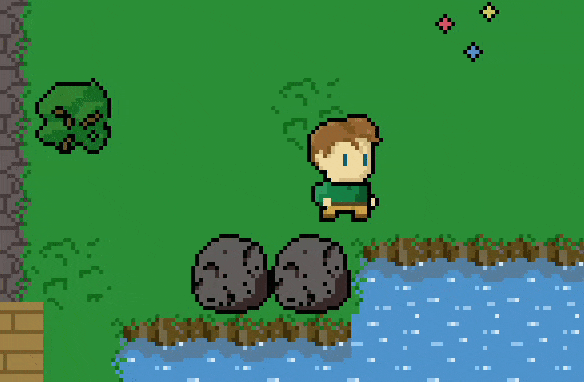
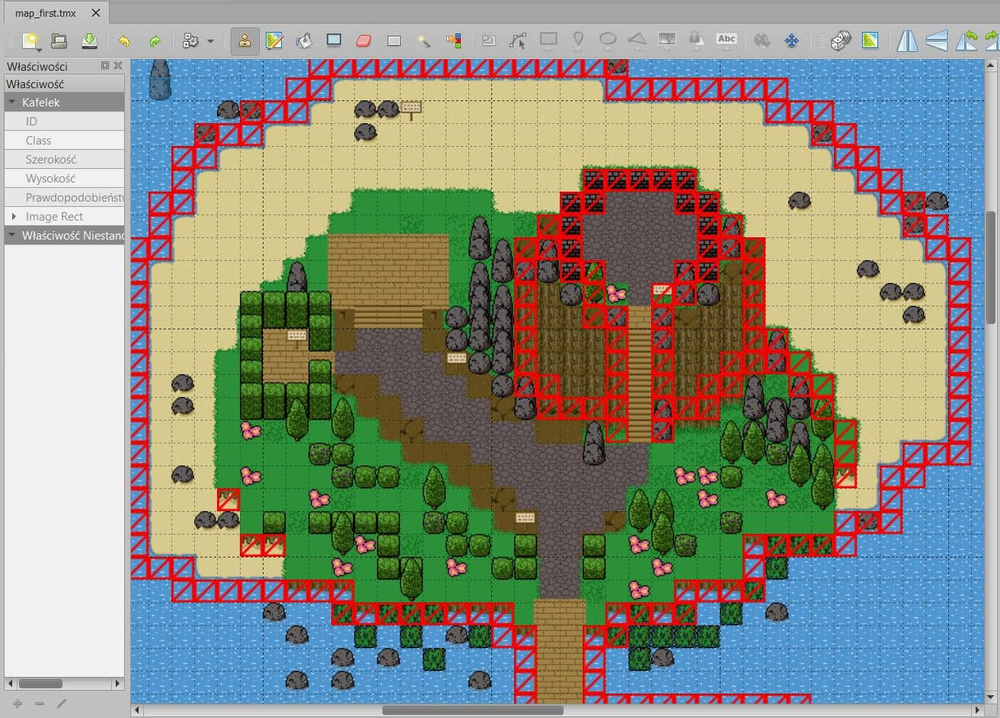
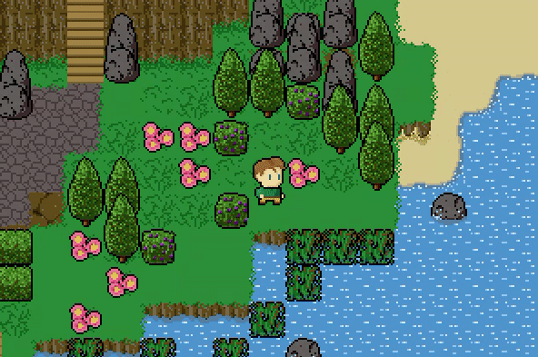

# Lochpython game

Lets say to be RPG game. Project ispired by [Zelda in Python](https://www.youtube.com/watch?v=QU1pPzEGrqw).

## Devlog

Project in development. Recent state:

## Todo

 - [x] TSX, TMX file support
 - [ ] TSM extra properties (place ontop, stack shift, can be moved, etc.)
 - [ ] Better animation signal distribution, TSX interval/duration usage
 - [ ] Lighting, light sources
 - [ ] TMX groups usege as elevations
 - [ ] Staircase implementation
 - [ ] Ingame objects placement and interactions

### Collison detection introduction

Steps:
1. select nearby objects (thin yellow border in the image),
2. evaluate collision separately in x and y and merge results (thick yellow border in the image),

Rectangles drawn using separate debbuging renderer.

### Delegation over inheritance - game objects system

Huge update and refactoring of entire code.

Game object is introduced. It stores dictionary of **properties**, and list of 3 types of methods introduced by those properties:
 - **input** - feeding data to next stage,
 - **update** - evaluating data and interaction with other properties,
 - **render** - passing results to separate rendering classes.

Properties derive from 3 types of Abstract properties which introduce previously mentioned methods:
 - **InputProperty** with abstract method _input_,
 - **UpdateProperty** with abstract method _update_,
 - **RenderProperty** with abstract method _render_.

Using multiple inheritance of Python each property can have any of above methods.

Properties can be used to create objects with any mix of functionalities, some of those are:
 - **SpriteProperty** - applying texture to object,
 - **AnimationProperty** - generic animation driving neighbouring _SpriteProperty_,
 - MovingProperty - used to move objects with speed and direction,
 - MovementAnimationProperty - specific type of animation used in moving of entities requiring _MovingProperty_.

### World Loader introduction

Data exported as **.csv** from **[Tiled](https://www.mapeditor.org/)** can be loaded. It is then split amoung 3 layers:
 - floor,
 - details,
 - entities (or objects).

This separation helps in sorting. 

Introduced list of obstacles interacting with **CollisionProperty** used to help evaluate collision detection.

Invisible borders (or limits) are used to prevent player from escaping the world. Those can be removed making e.g. walkable water.

### Scaling world surface

Game is meant to be **pixel-art**. 20x40px for character is more than enough. Global **scale** option - world is rendered to scaled down _surface_ and then scaled up to fill entire window. GUI elements are not treated with the scale. Antialiasing if turned off to obtain hard pixeled edge.

So far graphics were only placeholders. Final tilesize is sublimating, probably it will be 32px so some more concrete graphics are needed.

### New graphics and animation fixes

Changes:

 - Added new tilesets.
 - Reworked animation system, now world has its won list of timers. One timer can sontrol water, plants and other similar animations.
 - Added images metadata to make the code more DRY.
 - Player (entities) has idle animation state.

There is need for tiles builder and some reuse of common static properties.

Added another graphics, some of them needs tweaks and changes but it is not important.

Tiled was used to prepare map. There is need to create height layers and stack floor details.

### TSX, TMX fileformat (28.10.2022)

Changes:
 - Supported TSX, TMS fileformats with additional properties.
 - Added multiple hitboxes.

