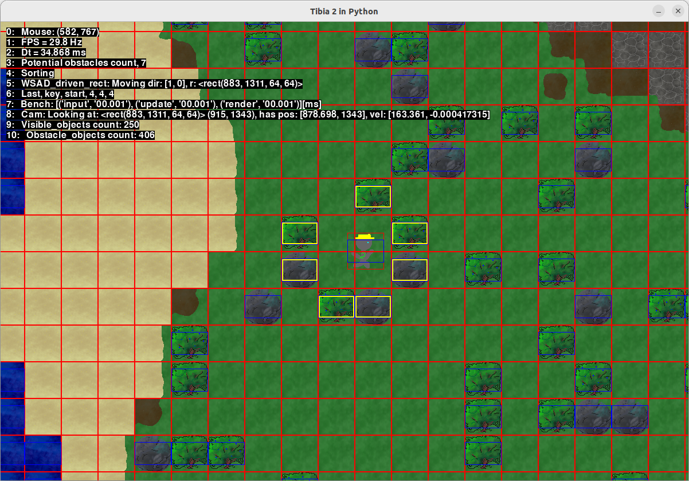

# Lochpython game

Lets say to be RPG game. Project ispired by [Zelda in Python](https://www.youtube.com/watch?v=QU1pPzEGrqw).

## Devlog

Project in development. Most recent screenshot:

### Collison detection introduction

Steps:
1. select nearby objects (thin yellow border in the image),
2. evaluate collision separately in x and y and merge results (thick yellow border in the image),

Rectangles drawn using separate debbuging renderer.

### Delegation over inheritance - game objects system

Huge update and refactoring of entire code.

Game object is introduced. It stores dictionary of **properties**, and list of 3 types of methods introduced by those properties:
 - **input** - feeding data to next stage,
 - **update** - evaluating data and interaction with other properties,
 - **render** - passing results to separate rendering classes.

Properties derive from 3 types of Abstract properties which introduce previously mentioned methods:
 - **InputProperty** with abstract method _input_,
 - **UpdateProperty** with abstract method _update_,
 - **RenderProperty** with abstract method _render_.

Using multiple inheritance of Python each property can have any of above methods.

Properties can be used to create objects with any mix of functionalities, some of those are:
 - **SpriteProperty** - applying texture to object,
 - **AnimationProperty** - generic animation driving neighbouring _SpriteProperty_,
 - MovingProperty - used to move objects with speed and direction,
 - MovementAnimationProperty - specific type of animation used in moving of entities requiring _MovingProperty_.

### World Loader introduction

Data exported as **.csv** from **[Tiled](https://www.mapeditor.org/)** can be loaded. It is then split amoung 3 layers:
 - floor,
 - details,
 - entities (or objects).

This separation helps in sorting. 

Introduced list of obstacles interacting with **CollisionProperty** used to help evaluate collision detection.

Invisible borders (or limits) are used to prevent player from escaping the world. Those can be removed making e.g. walkable water.

